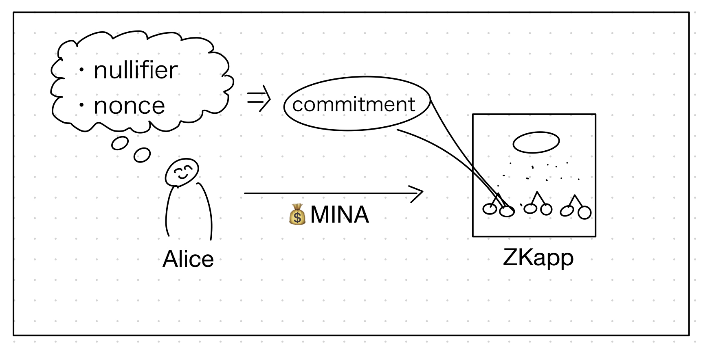
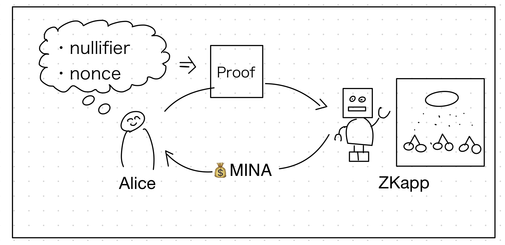

# TornadoMina: Tornado Cash on Mina protocol

## Concept

We implemented TornadoCash protocol on Mina protocol. TornadoCash realize the mixing of the tokens or native currency.

## Why

Mina protocol strong points are below

- constant size state proof, it realize constant size client node that have same power to the fullnode
- user privacy through zero knowledge

But the Mina protocol itself is so early stage on the roadmap. So a lot of informations like MINA balance, token balance are public.
Then we decided develop TornadoCash protocol on Mina in order to provide the basic user privacy.

## What this PoC can do

This product offers constant MINA native currency mixing and cli based demo using local network.

## Architecture

### Deposit



### Withdraw



## Problems

### Data availability

This PoC product assume that below 2 data is available and update offchain

- CommitmentHash MerkleMap
- NullifierHashesRoot MerkleMap

But the assumption is so strong known as data availability problem. Let's discuss with it.

## Development

### How to build

```sh
npm run build
```

### How to run tests

```sh
npm run test
npm run testw # watch mode
```

### How to run coverage

```sh
npm run coverage
```

#### Current Coverage

| File           | % Stmts | % Branch | % Funcs | % Lines |
|:---------------|--------:|---------:|--------:|--------:|
| All files      |     100 |      100 |     100 |     100 |
| TornadoMina.ts |     100 |      100 |     100 |     100 |

## License

[Apache-2.0](LICENSE)
